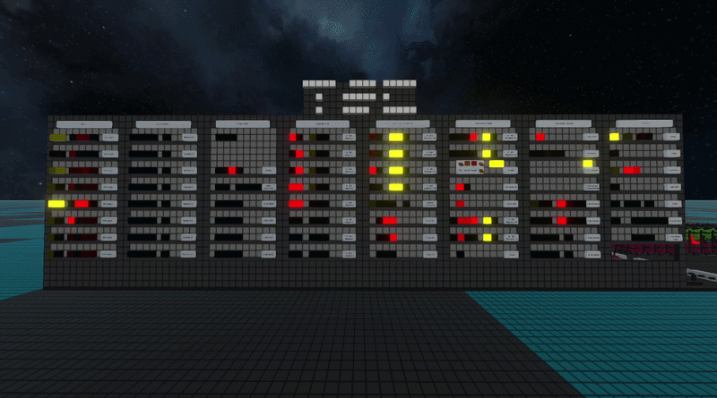

# HuntasAudioVisualEnhancements
A mod that adds extra sound and visual effects to components.

## Installation
Copy the `HuntasAudioVisualEnhancements` folder to `Logic World/GameData/`

## Included in the mod
- Makes displays act like incandescent bulbs.
- Adds a clicking noise to the display when it turns on/off.
- Settings to change the visuals of wires
- Settings to change the world lighting

## Suggested mods
- [EcconiasChaosClientMod](https://github.com/Ecconia/Ecconia-LogicWorld-Mods) to change the skybox

## Future plans
- Add a quiet buzzing noise to the display when illuminated.

## Credits
- Ecconia: Laser Wires